# ComfyUI System One (Jev / Laya / Clef)

Branch a ComfyUI workflow on a natural-language judgment. Ask "which style does
this prompt want?", "is this too graphic for kids?", or "does this name a real
person?" and get a typed answer your graph can route on: a label, a
probability, or a score, each with a confidence.

The nodes talk to three interchangeable **System One** decision models through
the same question and answer shape. Clef can also look at images, which turns
it into an automatic QA step for generated images.

| Backend | Where it runs | Cost | Setup |
| --- | --- | --- | --- |
| [Laya](https://huggingface.co/convaiinnovations/laya) | Locally, inside ComfyUI (MPS / CUDA / CPU) | Free | `pip install laya` |
| [Jev](https://docs.typesafe.ai) by TypeSafe | Hosted API | Per input token | `TYPESAFE_API_KEY` env var |
| [Clef / Clef-flash](https://developers.cloudflare.com/workers-ai/models/clef-flash/) by Cloudflare | Workers AI API, sees images | Per input token ($0.09/M for flash) | `CLOUDFLARE_ACCOUNT_ID` + `CLOUDFLARE_API_TOKEN` env vars |

Flip one dropdown on the **System One Backend** node to move a whole graph
between them.

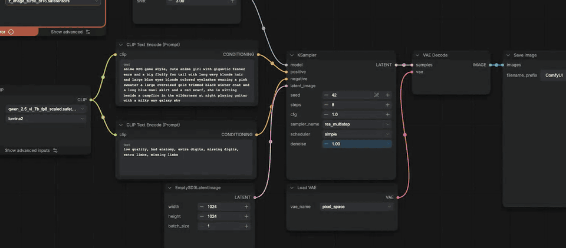

**New in 0.2.0:** automatic image QA with Cloudflare Clef. [Watch the 48-second intro](docs/media/clef-image-qa-promo.mp4).

## Install

From the [Comfy Registry](https://registry.comfy.org/nodes/comfyui-systemone):
search for **System One** in ComfyUI Manager, or run

```bash
comfy node install comfyui-systemone
```

Or install from source:

```bash
cd ComfyUI/custom_nodes
git clone https://github.com/dante01yoon/ComfyUI-SystemOne
pip install -r ComfyUI-SystemOne/requirements.txt
```

For the hosted backends, export the keys in the shell that starts ComfyUI:

```bash
export TYPESAFE_API_KEY=...          # Jev
export CLOUDFLARE_ACCOUNT_ID=...     # Clef
export CLOUDFLARE_API_TOKEN=...      # a token with Workers AI permission
```

Laya downloads its weights from Hugging Face on first use and caches them.
Loading takes about 6 seconds once per ComfyUI session; each answer after that
takes 0.03 to 0.3 seconds on an Apple Silicon Mac.

## Nodes

All nodes live under the **SystemOne** category.

| Node | Inputs | Outputs |
| --- | --- | --- |
| System One Backend | `provider` (laya / jev / clef-flash / clef), `laya_checkpoint`, `device`, `jev_model` | `backend` |
| System One Choice | `backend`, `state`, `instructions`, `options` (one `label: description` per line), `min_confidence`, `fallback` | `choice`, `confidence`, `confident`, `report` |
| System One Yes/No | `backend`, `state`, `instructions`, `true_criteria`, `false_criteria`, `threshold` | `probability`, `verdict`, `report` |
| System One Score | `backend`, `state`, `instructions`, `levels` (one per line, low to high) | `score`, `level`, `confidence`, `report` |
| System One Map | `key`, `mapping` (`key => value` lines, `* => default`) | `value` |
| System One Image Check (Clef) | `backend`, `images`, `instructions` (a yes/no question about one image), `reject_when` (yes / no), `threshold`, `context` | `passed` (images that pass), `passed_count`, `report` |
| System One Pick Best Image (Clef) | `backend`, `images`, `instructions`, `context` | `best`, `index`, `confidence`, `report` |

- `state` is the text the model judges, usually your prompt. Text that parses
  as a JSON object or array is sent as structured state.
- Choice falls back to `fallback` when confidence is below `min_confidence`,
  so an unsure model never picks a branch on a coin flip.
- `report` is JSON with the question, the raw answer, the backend, and the
  latency, for logging or debugging.
- Image Check asks its question about every image in the batch separately. If
  nothing passes, it blocks the nodes downstream, so nothing gets saved.
- Pick Best Image compares up to 4 images per call and runs heats plus a final
  for bigger batches. `index` points into the batch it received.
- Images go to Clef as downscaled JPEGs (long side 512 down to 256, to fit the
  Workers AI request budget). The `passed` and `best` outputs are your original
  full-resolution images.
- After a run, each judgment node shows its answer and every option's
  probability as a text bar on the node itself.

## Demos

Every demo below is a real recording of these workflows on ComfyUI with
[SDXL Turbo](https://huggingface.co/stabilityai/sdxl-turbo) (4 steps, 512px).
Each one ships as a drag-and-drop workflow in [`examples/`](examples). To run
the image demos, put `sd_xl_turbo_1.0_fp16.safetensors` in
`ComfyUI/models/checkpoints`.

### 1. Style router (Laya, local)

[`examples/style_router.json`](examples/style_router.json) ·
[video](docs/media/style_router.mp4)

A **Choice** node reads the prompt and picks `photo`, `anime`, `watercolor`, or
`render3d`. A **Map** node turns the label into style keywords, which are
appended to the prompt before sampling. With `min_confidence` at 0.5, an
ambiguous prompt falls back to `photo`.

| Prompt | Laya answer | Routed to |
| --- | --- | --- |
| watercolor painting of a cat sleeping by the window | watercolor 0.98 (confidence 0.92) | watercolor |
| cel-shaded anime girl with big eyes standing in the rain | anime 0.98 (confidence 0.90) | anime |
| a knight riding a dragon over a city | anime 0.65 (confidence 0.26) | photo (fallback) |

| Clear style | Ambiguous, falls back |
| --- | --- |
| 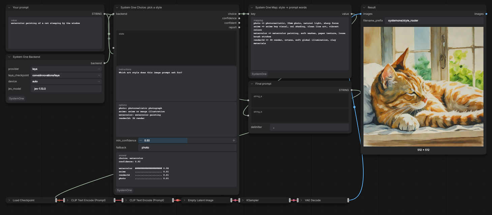 | 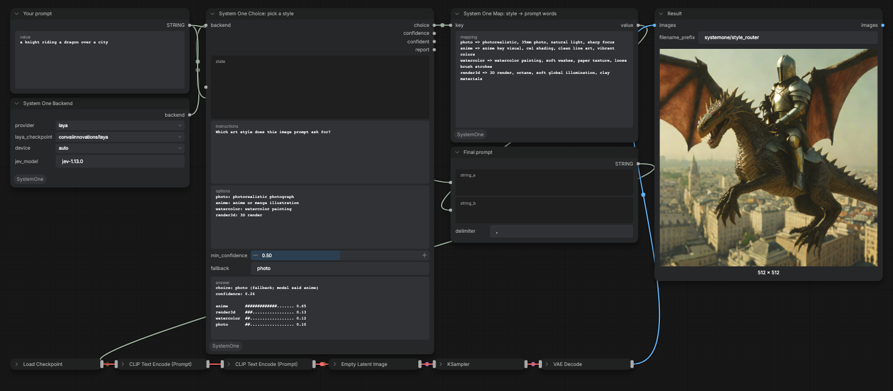 |

### 2. Kid-safe gate (Laya, local)

[`examples/kid_safe_gate.json`](examples/kid_safe_gate.json) ·
[video](docs/media/kid_safe_gate.mp4)

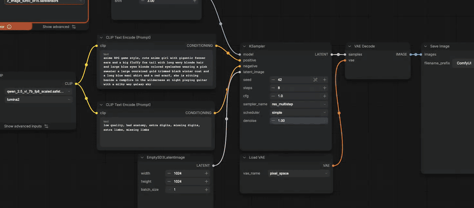

A **Score** node rates how graphic the requested image would be on four levels
(none, mild, strong, extreme). A math node checks `score >= 2`, and an If/Else
Switch swaps the prompt for a kid-safe replacement before anything is sampled,
so a gory image is never generated.

On a 12-prompt test set, every safe prompt scored 1.39 or lower (a knight
fighting a dragon, a pirate ship in a storm, a cartoon Halloween pumpkin) and
every gore prompt scored 2.39 or higher, so the 2.0 cut separated all 12. The
same question asked as a Yes/No got 11 of 12. In the recording, the gore
prompt scored 2.31, which still clears the cut but by a smaller margin; treat
the threshold as something to tune on your own prompts.

| Passes (score 1.48) | Swapped (score 2.31) |
| --- | --- |
| 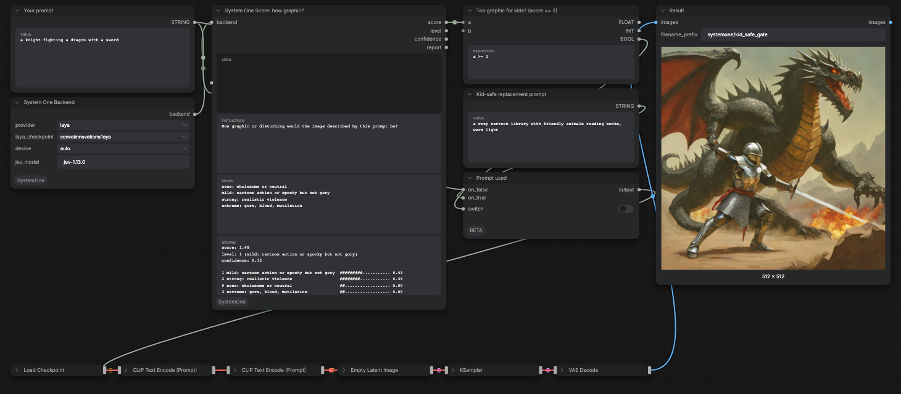 | 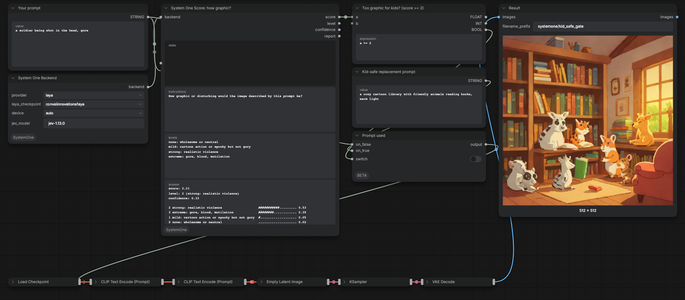 |

### 3. Real-person guard: Laya vs Jev, side by side

[`examples/celebrity_guard.json`](examples/celebrity_guard.json) ·
[video](docs/media/celebrity_guard.mp4)

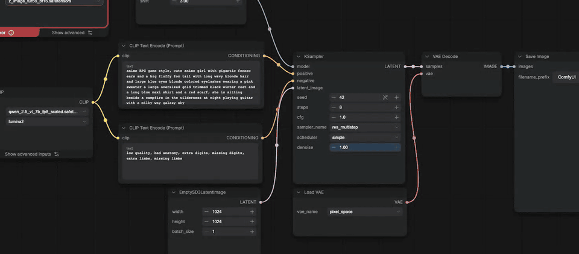

The same prompt goes to two **Yes/No** nodes, one per backend, asking whether
it names a real celebrity or public figure. A yes swaps in a stand-in prompt.
This demo stops before sampling on purpose, so it never renders a real
person's likeness.

| Prompt | Laya | Jev |
| --- | --- | --- |
| Taylor Swift on stage, concert photo | 0.47, passes | 0.99, swapped |
| Barack Obama eating ice cream on a bench | 0.36, passes | 0.99, swapped |
| a businessman giving a speech on stage | 0.39, passes | 0.03, passes |

Laya's scores for real and generic people overlap (0.33 to 0.47 against 0.39),
so no threshold separates them. Jev separates them by a wide margin. Use Jev
for this kind of check.

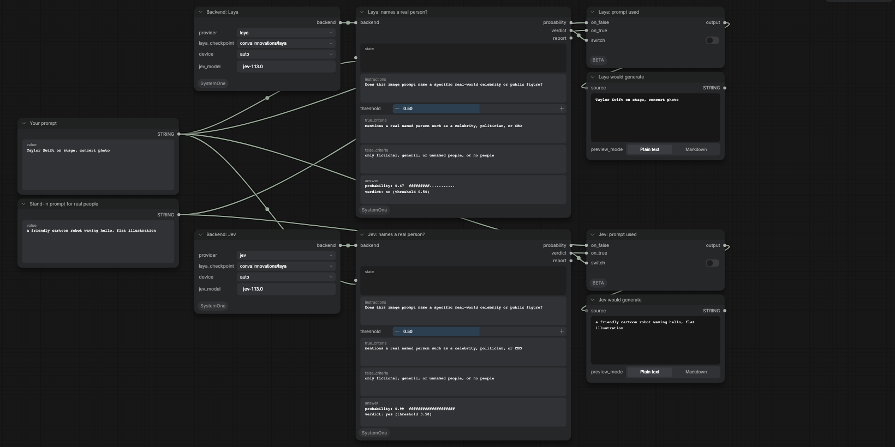

### 4. One dropdown, two models

[`examples/model_switch.json`](examples/model_switch.json) ·
[video](docs/media/model_switch.mp4)

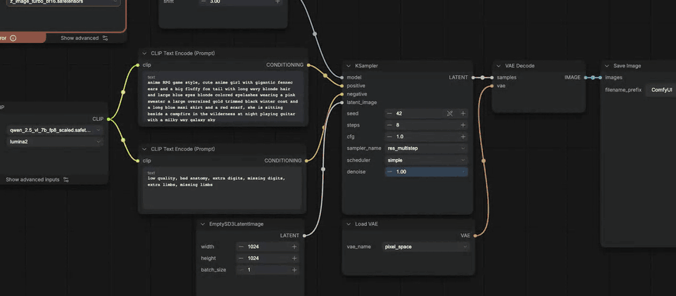

Demo 1's graph, run twice per prompt: once with the backend set to Laya, then
again after flipping it to Jev. These prompts imply a style through a
reference instead of naming it.

| Prompt | Laya | Jev |
| --- | --- | --- |
| a girl on a grassy hill under huge summer clouds, in the style of Studio Ghibli | anime, confidence 0.07, falls back to photo | anime, confidence 1.00 |
| a lighthouse at dusk, loose wet-on-wet brushwork | watercolor, confidence 0.19, falls back to photo | watercolor, confidence 1.00 |

| Laya | Jev |
| --- | --- |
| 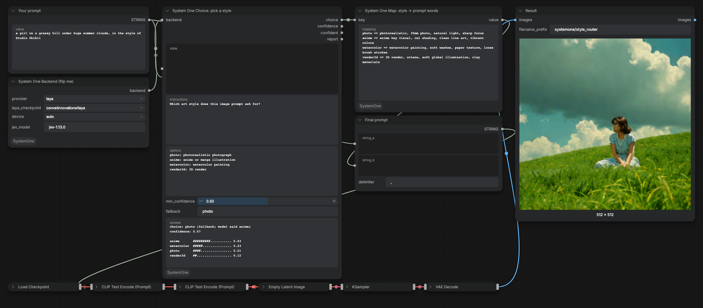 | 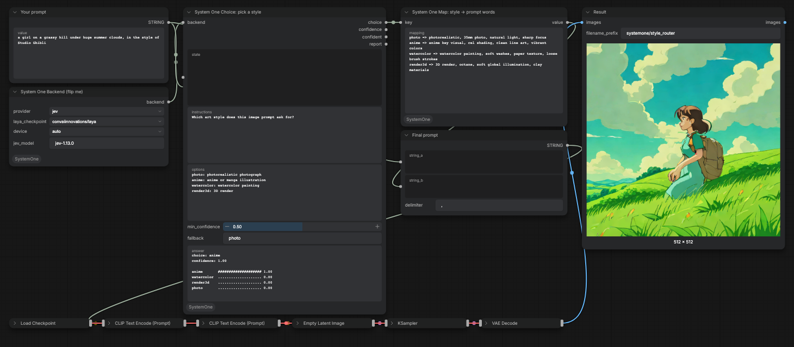 |
| 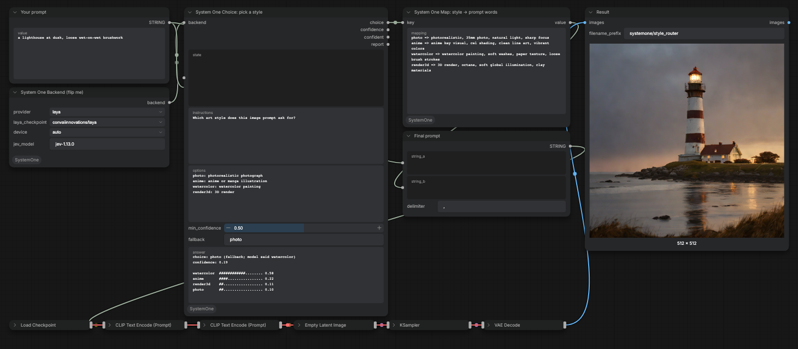 | 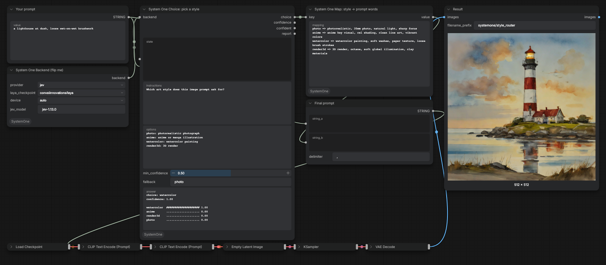 |

On 8 such prompts (Ghibli, Pixar, Makoto Shinkai, Unreal Engine 5, Canon 5D,
National Geographic, wet-on-wet), Jev answered all 8 correctly with confidence
0.99 or higher. Laya's top answer was right on 7, but 4 of those had
confidence below 0.5, so with demo 1's gate Laya routes 3 of 8 to the intended
style.

### 5. Automated image QA (Clef-flash)

[`examples/image_qa.json`](examples/image_qa.json) ·
[video](docs/media/image_qa.mp4)

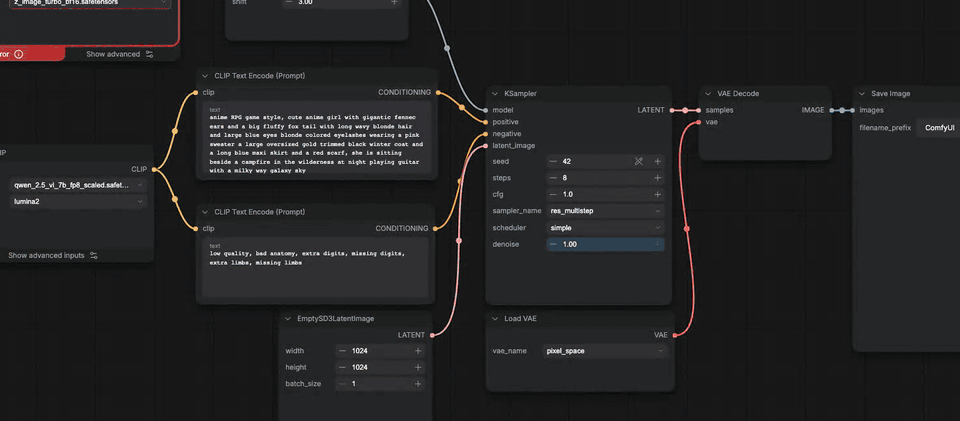

SDXL Turbo renders 4 candidates for "exactly three red apples on a white
table". **Image Check** asks Clef-flash about each one: "Does the image show
exactly three apples, no more and no fewer?" Images that fail are dropped.
**Pick Best Image** then chooses among the survivors, and only that one is
saved. Nobody has to look through the batch.

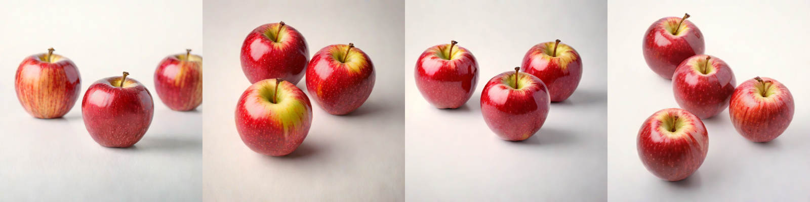

| Candidate | Apples | Clef-flash "exactly three?" | Result |
| --- | --- | --- | --- |
| 1 | 3 | 0.96 | pass |
| 2 | 3 | 0.97 | pass |
| 3 | 3 | 0.97 | pass, picked as best (0.79) |
| 4 | 4 | 0.03 | rejected |

A second seed in the recording also caught the one bad image (five apples) and
kept three; the pick among three near-identical survivors came back with low
confidence (0.16), which is a cue that any of them would do.

Clef-flash really reads the image rather than the prompt. Asked "does this
image match a watercolor cat?" about a photo of a knight, it said 0.004; the
same question with no image attached said 0.90. Given four different images
and four prompts, it picked the right image for each, with confidence 0.92 to
0.96, in 0.3 to 0.9 seconds per call.

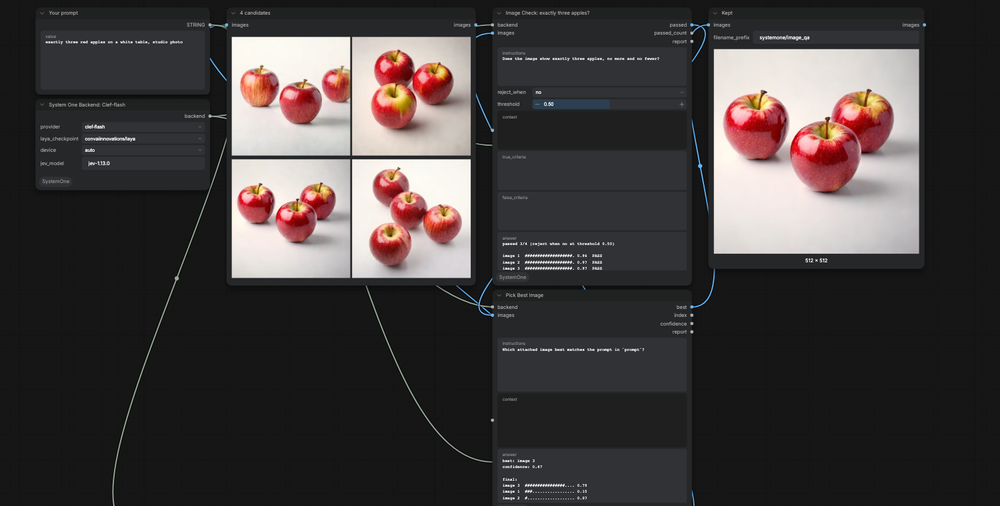

## Choosing a backend

Measured on 2026-10-02 with `laya` 0.3.24 (`convaiinnovations/laya`, MPS) and
`jev-1.13.0`:

| Task | Laya | Jev |
| --- | --- | --- |
| English prompt that names its style | Correct, confidence 0.5 to 0.99 | Correct, confidence 1.00 |
| Style implied by a reference (Ghibli, Pixar) | Mostly right, low confidence | Correct, confidence 0.99+ |
| Korean prompt ("수채화", "셀 셰이딩 애니메이션") | Wrong | Correct |
| Names a real celebrity or public figure | Cannot separate | 0.99 vs 0.03 |
| Graphic or gory content (Score) | Separated 12 of 12 at 2.0 | Not measured |
| Latency per answer | 0.03 to 0.3 s, local | 0.15 to 0.23 s, network |
| Looks at images | No | No |

Start with Laya for explicit, English, local judgments. Switch to Jev when the
answer needs world knowledge (people, artists, studios) or another language.
Use Clef when the question is about the generated image itself; it answered
the image questions above in 0.3 to 0.9 s.

## Re-recording the demos

The recordings come from two scripts, so you can reproduce or change them.

- `scripts/run_demo.py` queues an API-format workflow once per prompt and
  prints each node's answer. It needs only Python and a running ComfyUI.
- `scripts/record_demo.mjs` opens ComfyUI in Playwright, lays out the nodes,
  types each prompt, clicks Run, and records the screen. An argument like
  `@2.provider=jev` changes a widget between runs. `scripts/make_media.sh`
  turns the recording into an MP4 and a README GIF.

```bash
python scripts/run_demo.py examples/style_router.api.json --prompt-node 3 \
  --prompts "watercolor painting of a cat" "a knight riding a dragon over a city"

npm install
node scripts/record_demo.mjs examples/model_switch.api.json 3 \
  "a lighthouse at dusk, loose wet-on-wet brushwork" "@2.provider=jev" \
  "a lighthouse at dusk, loose wet-on-wet brushwork"
START=2 scripts/make_media.sh model_switch
```

Both scripts expect ComfyUI on `http://127.0.0.1:8199`. Override it with
`--base` or `COMFY_URL`.

## Limits

- Laya and Jev judge text only; give image questions to a Clef backend.
- Workers AI estimates a request's size from its raw body, so Clef calls carry
  at most 4 images and downscale them to fit. A 512px PNG batch of four is
  rejected before the model sees it; the nodes handle this for you.
- Laya reads at most 512 tokens of state, and its option labels share a
  192-token budget.
- Laya's checkpoint warns that some of its temperatures are outside the
  expected range, so treat its confidence as uncalibrated.
- SDXL Turbo, used in the demos, is under a non-commercial research license.
  The nodes themselves are MIT.

## Tests

```bash
python -m pytest tests -q
```

The tests use a fake backend, so they need neither model nor network.
